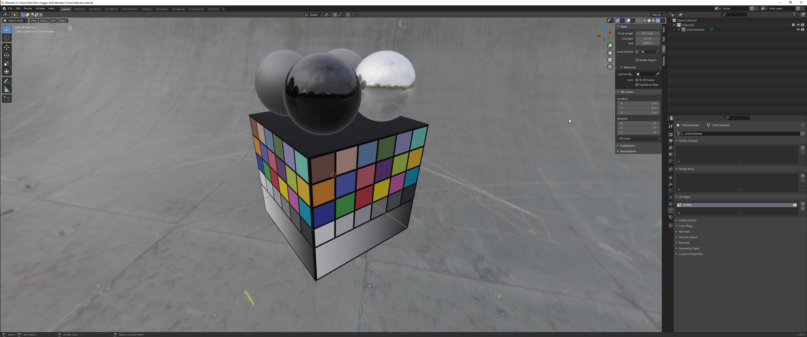
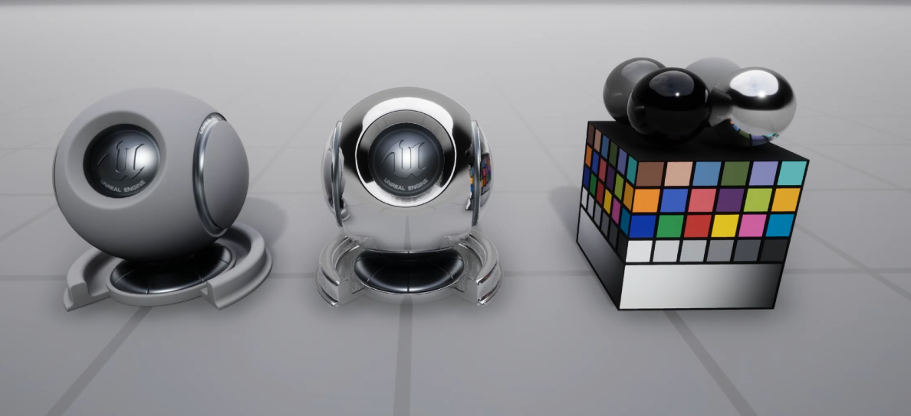

# General
Comparison project between Godot and Blender shading/color/lighting.
Assets can be used to also tweak scene setup for neutral lighting.

# Credit

| Asset | Source | License |
| ------ | ------ | ------ |
| HDR background | https://polyhaven.com/a/skate_park | CC0 |
| Color Calibrator with Macbeth chart (Unreal engine inspired) | Myself | CC0 |
